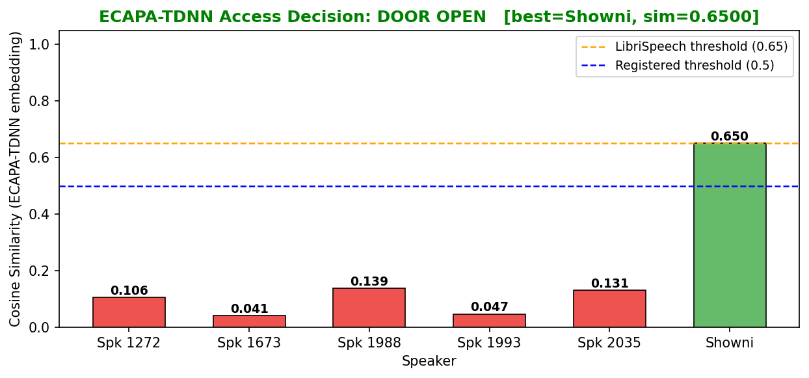
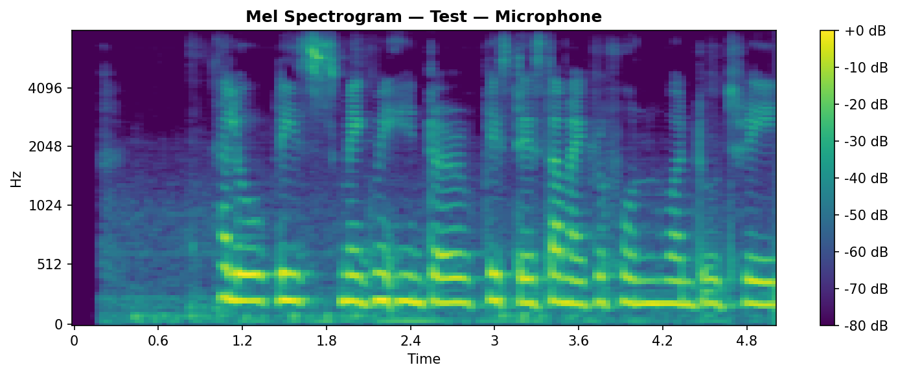

# Smart-Door-Access-System--using-ECAPA-TDNN
This project presents an advanced Biometric Access Control System that utilizes state-of-the-art Speaker Verification to provide secure, hands-free entry.  

[Pipelineof the project](Pipeline.png)
## 📁 Project Contents
* **smart_door_ecapa.py**: Main Python implementation of the verification logic.
* **smart_door_Course_report.docx**: Comprehensive documentation and project report.
* **dev-clean/**: Dataset directory (based on LibriSpeech).

## 📊 Results & Visualization
Below are the analysis results from the voice processing module:

### Speaker Decision Logic

### Spectrogram Analysis

